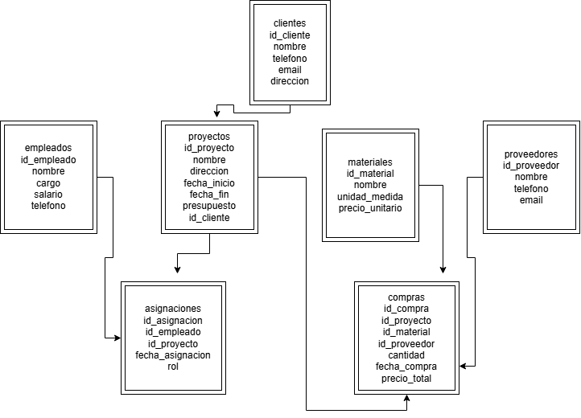

Информационная система: «Строительная фирма»

Дисциплина: Автоматизация и информатизация технологических процессов в металлургии  
Тема 26:Разработка информационной системы «Строительная фирма»

Описание: Информационная система для управления строительной фирмой. Позволяет вести учёт клиентов, сотрудников, проектов, материалов, поставщиков, назначений персонала и закупок материалов.

Используемые технологии:

- PostgreSQL 18 — система управления базами данных
- pgAdmin 4— администрирование базы данных
- draw.io — проектирование ER-диаграммы (диаграммы «сущность — связь»)

Структура проекта:

- `01_crear_tablas.sql` — скрипт создания 7 таблиц
- `02_insertar_datos.sql` — тестовые данные
- `03_consultas.sql` — тестовые запросы
- `diagrama_er.png` — ER-диаграмма

Модель данных:

| Таблица | Описание |
|---|---|
| `clientes` | Физические или юридические лица, заказывающие работы |
| `empleados` | Сотрудники строительной фирмы |
| `proyectos` | Выполняемые объекты строительства |
| `materiales` | Строительные материалы |
| `proveedores` | Компании-поставщики материалов |
| `asignaciones` | Связь между сотрудниками и проектами |
| `compras` | Закупки материалов по проектам и поставщикам |
ER-диаграмма

Как запустить:

1. Создать базу данных `constructora_db` в PostgreSQL.
2. Выполнить `01_crear_tablas.sql`.
3. Выполнить `02_insertar_datos.sql`.
4. (Опционально) Выполнить запросы из `03_consultas.sql`.

Автор:

ФИО:Елена Ривера Родригес  
Группа:HTMT-152201
